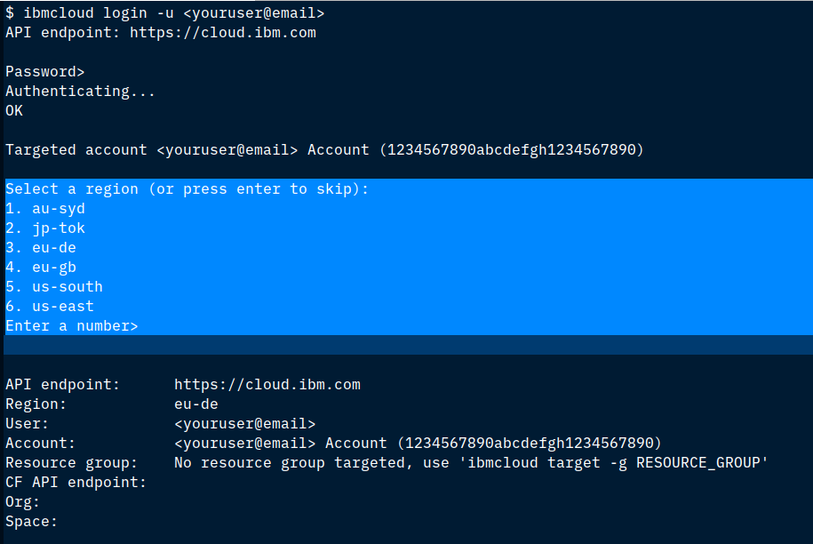
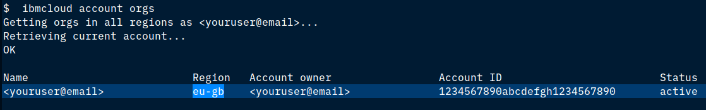
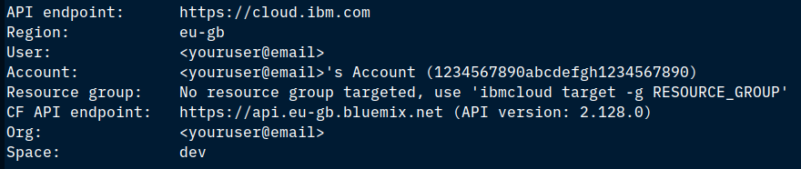
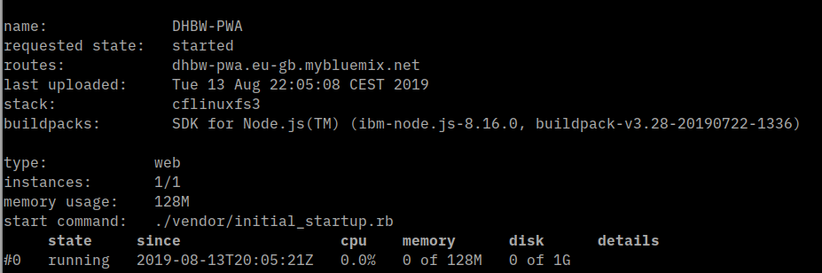
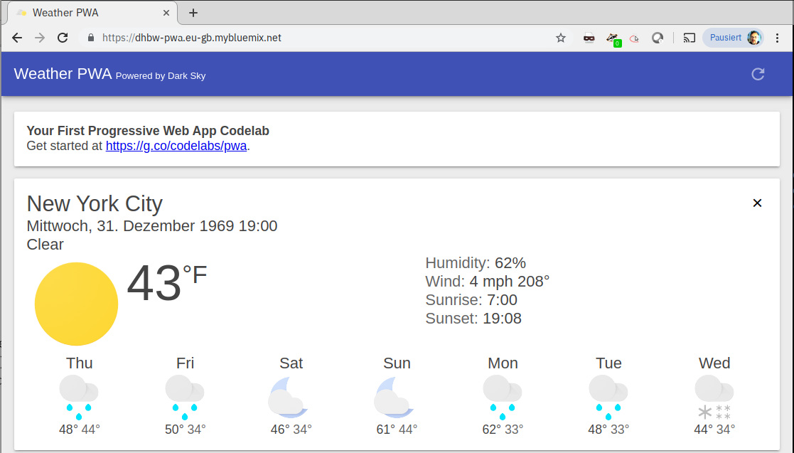

# Your First Progressive Web App
## Deployed into Cloud Foundry on IBM Cloud

This tutorial is based on [Your First Progressive Web App](https://developers.google.com/web/fundamentals/codelabs/your-first-pwapp/). The original tutorial is available as PDF (media/Your First Progressive Web App.pdf) in the repository. I made some modifications to the code to be able to deploy it as Cloud Foundry app on the IBM Cloud:

* Added manifest.yml: Required to automatically deploy
* package.json: removed express-http-to-https, added cfenv 
* server.js:
    -  removed express-http-to-https, added cfenv as required
    -  removed https redirect (CF is terminating HTTPS at the Router)
    -  read port number, host, and URL from CF Environment

 ## Prequisites   

 ### Chrome Browser

 The tutorial makes use of "Lighthouse". a developer tool that is only available in the Google Chrome Browser.

 ### Dark Sky API

 This is actually optional. If you want live weather data instead of simulated data you need to get a Dark Sky API key, see [instructions ](https://developers.google.com/web/fundamentals/codelabs/your-first-pwapp/#get_a_key_for_the_dark_sky_api).

### IBM Cloud Account

If you haven't done already, register for a free IBM Cloud account [here](https://cloud.ibm.com) (Button on the left side). After registration check your emails for a verification mail, you need to click a link in the mail to complete the registration. Then logon to the IBM Cloud using the same URL.

Follow these instructions to install the [IBM Cloud-CLI](https://cloud.ibm.com/docs/cli?topic=cloud-cli-install-ibmcloud-cli#install-ibmcloud-cli) for your OS.

Login to the IBM Cloud using the email address you registered with:

```
$ ibmcloud login -u <youruser@email>
```

You will see something like this:



Press 'Enter' to skip the selection of a region!

Cloud Foundry has a way to organize projects into regions, organizations, and spaces. We need to target the correct one. Display some account details with:

```
$ ibmcloud account orgs 
```



This example account is active in Region 'eu-gb' (= London). Set the Cloud Foundry region to the region you just determined for your account and then set the other Cloud Foundry specifics to the defaults for that region:

```
$ ibmcloud target -r  eu-gb
$ ibmcloud target --cf
```

The result should look similar to this:


Region, Org, and Space are now set.

## Initial Deployment of the unmodified PWA

Edit the file 'manifest.yml':

```
---
applications:
- instances: 1
  name: <YourInitialsHere>-PWA
  memory: 128MB
  random-route: false
```
Change `<YourInitialHere>` to your own initials. This name must be unique hence the initials. Be careful: YAML (Yet Another Markup Language) is very specific with indents, dashes (-),  and spaces. Do not change the overall structure of the file! Save it and then push the app to the IBM Cloud with:

```
$ ibmcloud app push
```

The end result hopefully looks something like this:



The state should be 'running' and the routes should show a value: this is the URL of the app, copy it into a browser, add 'https://' in front, and see what happens:



This is the unmodified Progressive Web App, now continue with the original instructions at:
[https://developers.google.com/web/fundamentals/codelabs/your-first-pwapp/](https://developers.google.com/web/fundamentals/codelabs/your-first-pwapp/), but skip the sections:

- Strongly Recommended: Use Glitch to import the repo _(we use the IBM Cloud instead)_
- Alternative: Download code & work locally, Download source code 


